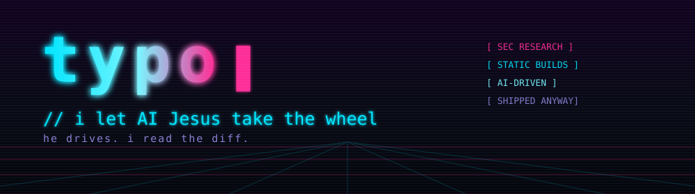

```console
$ whoami
typo — independent security researcher, developer, professional prompt-haver

$ cat ./policy
point AI at a problem. read the diff. keep what survives contact with reality.
```

This is where the AI runs wild.

Everything published here started as something I actually needed — a thing that
broke in the wild, a gap in my own tooling, a problem I got tired of solving by
hand. The machine did most of the typing. I picked the direction, argued with
it, and kept the parts that held up.

It's not *only* slop. It's also definitely not hand-carved, artisanal,
small-batch code. It's the honest middle: fast to build, tested harder than you
would expect, and published because it turned out to be genuinely useful.

---

## ▚ what's parked here

### ▸ shipping

| project | status | what it is |
| --- | --- | --- |
| **[statics](https://github.com/0typos/statics)** | `live` | Static Linux troubleshooting binaries for the machine with no package manager, no libc you trust, and no network you control. 13 architectures, musl + pinned Zig, rebuilt monthly, SBOMs and Sigstore attestations on every release. |

> AI wrote a lot of that. AI does not get to skip the reproducibility check.

### ▸ inbound

| project | status | what it is |
| --- | --- | --- |
| **glacialcast** | `pre-1.0` | End-to-end-encrypted, low-bandwidth Wayland screen viewer with bounded history. Rust, native portal + PipeWire capture, VA-API H.264, CENC fMP4 over MPEG-DASH, browser viewer on MSE and Clear Key. The relay never sees your key. |

> Lands here once I stop finding bugs in it. Current pace suggests a while.

---

## ▚ house rules

- **If it's here, it works.** For me. On my hardware. Under my assumptions.
  Your mileage is a research opportunity.
- **Verification is not negotiable.** Sources pinned by digest, actions pinned
  by SHA, base images pinned by hash. The model is fast and confident, which is
  exactly why the gates exist.
- **Bugs are welcome.** Open an issue. I will point AI Jesus at it and read the
  resulting diff with appropriate suspicion.
- **No warranty, no roadmap, no vibes-based release schedule.** Just cron.

```console
$ ./typo --status
[ OK ]   builds ............ reproducible
[ OK ]   supply chain ...... pinned, digested, attested
[ OK ]   copilot ........... enthusiastic
[WARN]   humans in the loop  1
[ OK ]   status ............ shipping anyway
```
